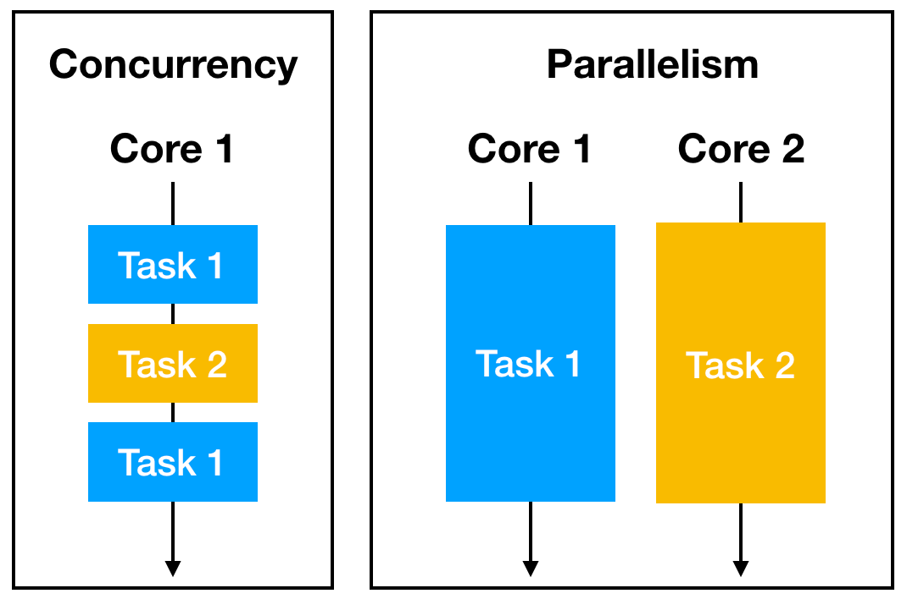

Em um cenário ficticio, uma empresa estava com problema no módulo de folha de pagamento
O cálculo de todas as folhas de pagamento dos clientes leva mais de 20 horas,
o que é muito longo para os nossos clientes.

O problema é que os cálculos são muito lentos e demorados.
Eles são lentos devido à sua natureza complexa, considerando muitos fatores, como:
ausências de funcionários, datas de adesão, horas extras e milhares de outros
fatores.

Eles tentaram adicionar mais núcleos de processador e memória ao servidor que executa
o módulo, mas isso não fez absolutamente nenhuma diferença.

É possível usar os processadores extras para executar tarefas
em paralelo e finalizá-las mais rapidamente

Isso só será possível se escrevermos o código de uma forma que aproveite
ao máximo os recursos de processamento extra

Se o código não for escrito de uma maneira que aproveite os núcleos adicionais, não fará
diferença alocar vários processadores. O código precisa usar programação concorrente para ser
executado mais rapidamente quando você adiciona mais recursos de processamento.

Não adianta apenas adicionar mais funcionários no balcão, 
tem que orientar a fila nos balções...

A solução foi dividir a folha de pagamento em grupos menores de funcionários
e depois chamar o módulo da folha de pagamento com cada grupo como entrada.

O código chama o módulo de forma concorrente usando goroutines, um canal Go para
balancear a carga de trabalho, e no final uma goroutine que coleta os resultados por meio de outro canal.

Fazendo simulações, foi menos cinco vezes mais rápido no mesmo hardware multicore.
Testes precisaram ser feitos para garantir que não haja race conditions.

O poder computacional extra só pode ser aproveitado de forma eficaz se nosso código
for escrito de uma maneira que aproveite ao máximo as unidades de processamento extras.

E um sistema que possui apenas um processador?

Mesmo com um processador, podemos melhorar o desempenho se utilizarmos tempos ociosos.

Podemos aumentar o rendimento mesmo quando temos apenas um
processador se nossa programação concorrente fizer uso eficaz dos tempos de
espera de I/O

Em 1978, CAR Hoare descreveu pela primeira vez processos sequenciais
de comunicação (CSP) como uma linguagem formal para expressar
interações concorrentes.

Esse modelo de concorrencia de ter goroutines isoladas se comunicando e
sincronizando usando canais reduz o risco de race conditions

A lei de Amdahl nos diz que a escalabilidade do desempenho de um
problema de tamanho fixo é limitada pelas partes não paralelas de uma execução.

A lei de Gustafson nos diz que se continuarmos a encontrar formas de
manter os nossos recursos extra ocupados, a aceleração deverá
continuar a aumentar e não ser limitada pela parte serial do problema.

## Concorrência vs Paralelismo

Concorrência significa planejar como realizar muitas tarefas ao mesmo tempo.
Paralelismo consiste em executar muitas tarefas ao mesmo tempo.

A programação concorrente ocorre
sempre que escrevemos nossos programas de uma forma que agrupa instruções em tarefas
separadas, delineando os limites e pontos de sincronização, 
é código escrito de uma maneira que aproveite os núcleos de CPU adicionais,
é código que utiliza os tempos ociosos, ou seja, faz uso eficaz dos tempos
de espera de I/O.

Paralelismo ocorre quando várias tarefas são executadas ao mesmo tempo em 
núcleos de CPU separados.

Um programa concorrente mas não paralelo seria um programa que roda com apenas
1 CPU, que executa 2 goroutines ao mesmo tempo, as duas goroutines serão 
concorrentes, o que significa que o sistema operacional pode intercalar a execução 
delas, fazendo com que pareçam estar sendo executadas ao mesmo tempo, 
as goroutines não serão executadas verdadeiramente ao mesmo tempo em núcleos separados. 

Em vez disso, o sistema operacional alternará a execução entre as goroutines de forma 
que pareça haver paralelismo, mas na realidade as goroutines compartilham o mesmo recurso de CPU.

Se rodarmos duas goroutines com 2 CPUs, ai sim teríamos programação concorrente e paralela, 
as duas goroutines seriam executadas verdadeiramente ao mesmo tempo em núcleos de CPU separados.

Um programa que é paralelo mas não concorrente seria um programa que diferentes partes do 
código são executadas simultaneamente em núcleos de CPU separados, mas não há intercalação 
ou coordenação entre essas partes. Cada parte do código é executada de forma independente, 
sem compartilhar recursos ou sincronização.

Ou seja, a programação concorrente é aquela que 2 partes do código rodam,
de forma paralela ou não, mas essas 2 partes do código são dependentes,
precisam ser coordenadas, em determinado momento uma precisa pausar, 
esperar a outra, precisam compartilhar dados, como a CSP.

Um programa paralelo com apenas 1 CPU é igual a um programa concorrente sem paralelismo.

Um programa que é paralelo, mas só tem uma CPU, efetivamente se torna concorrente sem 
paralelismo prático. Isso significa que, embora o programa possa estar estruturado 
para executar diferentes partes do código simultaneamente, na prática, 
devido à limitação de recursos, essas partes do código são executadas de forma intercalada 
em um único núcleo de CPU, não havendo execução verdadeiramente simultânea em núcleos separados.

### Resumo:

 
- Programação concorrente é você ter 1 thread com 2 (ou mais) tasks se revesando, coordenadas.
- Programação paralela é você ter 2 (ou mais) threads, cada uma executando 1 task.
- Programação concorrente E paralela é você ter 2 (ou mais) threads, cada uma das threads
com 2 (ou mais) tasks se revesando, coordenadas.